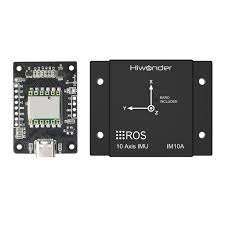

# Hiwonder_imu
Hiwonder imu calibration and support for ros2 (Humble).
Simple overview of use/purpose.

## Description

Hiwonder IMU support for ROS2 Humble and data extraction from hexadecimal data via serial port.
in-depth data explicit and values calibration respective to specific values.



## Getting Started

### On system 

* ROS2 Humble 
* Ubuntu 22.04

### Dependencies

* rclpy
* rclcpp
* sensor_msgs
* other ros2 support message type's
* serial (python)

### Installing

* How/where to download your 
* Any modifications needed to be made to files/folders

### Executing program

* clone repository 
```
git clone git@github.com:Himanshukohale22/Hiwonder_imu.git
```
* Test imu data using simple python serial data explicit file
```
python3 run simple_imu.py
```
* Use the IMU to rotate and check in terminal for readings.
* Now run the node.
```
ros2 run python_imu pub.py
```
* Now go for launch file 
```
ros2 launch python_imu rviz.launch.py
```
* Will see interface like this 


## Authors
Himanshu kohale - 
[Himanshu kohale](kohalehimanshu22@gmail.com)
